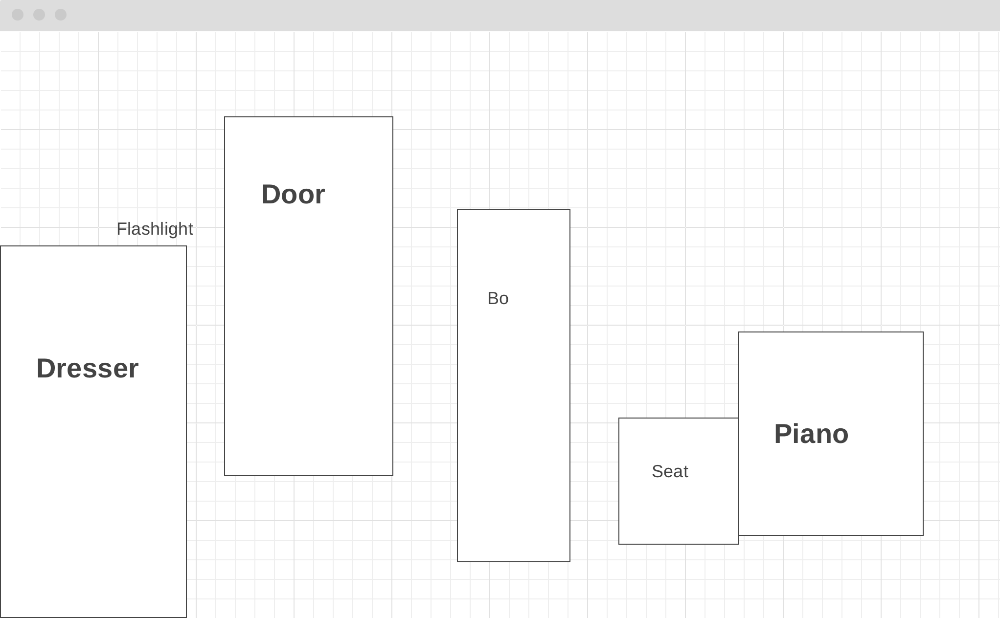

# Inside A Game

In March of 2021, Bo Burnham released his Netflix 
special, "Inside", in the middle of the pandemic. 
Written, recorded, and filmed in one room by on man, 
the special revolves around the comic's sense of isolation 
and depression and his general pessimistic view of society.

After the intermission and another song about anxiety,
Bo Burnham pretends to live stream a video game called 
'Inside' by SSRI Interactive. Bo plays himself stuck in
a room, where his character's only options are to cry,
find a flashlight, and play the piano. I will recreate
this game. 

---

## In "Inside A Game," users will be able to:

- Control Bo as he walks around his room
- Make Bo cry
- Pickup and turn on a flashlight
- Play the piano
- Try to open the door

### In addition, this project will include

- Sound bytes of piano and Bo crying
- Floating text and highlights to guide user
- Title screen and menu
- A README guide
- Instill a general feeling of clausterphobia  

---

## Wireframes

- Flashlight pickup interaction
- Piano play interaction 
- Door try-handle interaction

## Technologies, Libraries, APIs
- The Canvas API to manage images 
- Webpack to manage JS code
- Npm to manage project dependencies 

## Implementation Timeline
- **Friday Afternoon & Weekend:** Decide to use photos or 8-bit art to display game and objects. Cutout the photos or draw 8-bit art of Bo and his room. Setup canvas and put all the art onto the screen, storing the images as objects I can later manipulate.
- **Monday:** Start to implement logic. Trace places for Bo to walk. Make some collision logic. Test it. 
- **Tuesday:** Write flashlight and piano code.
- **Wednesday:** Write instructions guide, dubug, and implement some audio if possible.
- **Thursday:** Deploy.